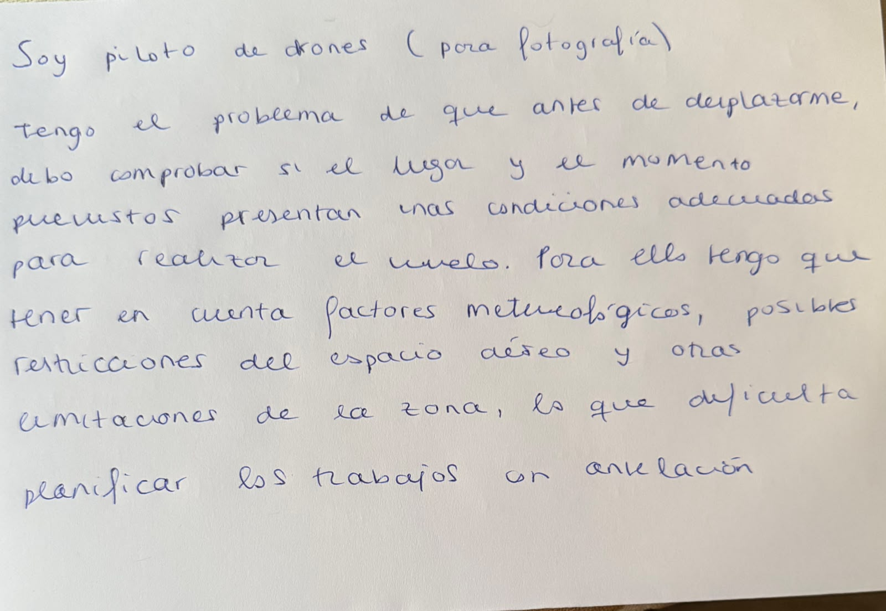

# OleoGest
Gestión y analisis de parcelas de olivas.

## Cliente

## Problema
Soy un agricultor que tiene varias parcelas de olivar situadas en distintos lugares. Esto hace que cada parcela tenga características y condiciones diferentes, como el clima de su localización, la humedad en el ambiente, el tipo de suelo, la edad del olivar o la variedad de aceituna.

No obstante como las características y condiciones de cada parcela son diferentes y además algunas cambian con el tiempo, resulta difícil planificar correctamente cuándo necesita atención cada una para las distintas labores de mantenimiento.

