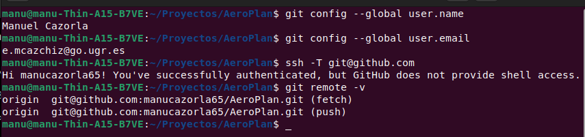
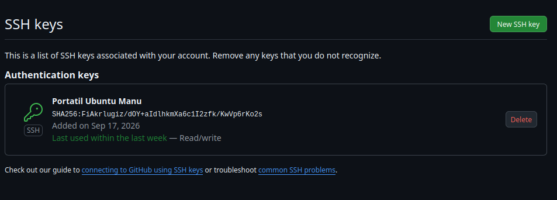
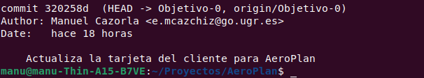

# Configuración del repositorio

## Configuración de Git y conexión con GitHub

Se ha configurado Git con el nombre y correo utilizados para trabajar en el repositorio. También se ha configurado la autenticación mediante SSH y se ha comprobado correctamente la conexión con GitHub.

Además, el repositorio local está conectado mediante SSH al repositorio remoto de AeroPlan.

## Clave SSH en GitHub

La clave pública SSH utilizada para la autenticación se encuentra registrada en la cuenta de GitHub.

## Rama e historial de Git

El trabajo correspondiente al objetivo se realiza sobre la rama `Objetivo-0`. En el historial de Git se puede comprobar tanto la rama utilizada como el autor de los commits realizados.

